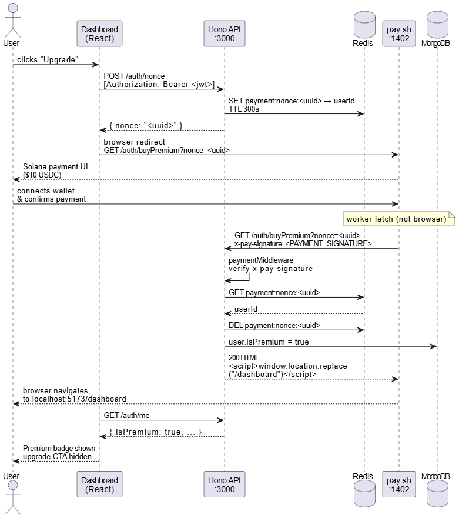

# DataNow

An AI-powered data analysis platform. Upload CSV, PDF, or JSON files and get LLM-generated summaries and trend analysis, with a premium tier unlocked via Solana Payments using Pay.sh.

---

## Features

- **Multi-format file support** — Upload CSV, PDF, and JSON files (5 MB free / 50 MB premium)
- **AI analysis** — LLM-generated summaries for all formats; trend analysis with anomaly detection and forecasting for CSV
- **Result caching** — Redis caches analysis results for 3 hours to avoid redundant LLM calls
- **Rate limiting** — Free tier capped at 3 analysis requests/hour; premium users get unlimited access
- **Blockchain payments** — Upgrade to premium via Solana Pay (USDC, $10 one-time)
- **S3 file storage** — Files stored in MinIO with per-user scoped access
- **JWT authentication** — Stateless auth with bcrypt password hashing
- **Dark mode** — Full theme support via shadcn/Tailwind

---

## Stack

### API
| Layer | Technology |
|---|---|
| Runtime | Bun |
| Framework | Hono 4.x |
| Language | TypeScript |
| Database | MongoDB (Mongoose) |
| Cache | Redis |
| Object Storage | MinIO (S3-compatible) |
| LLM Inference | Ollama (Gemma 4) |
| Auth | JWT |

### Frontend
| Layer | Technology |
|---|---|
| Framework | React 19 |
| Build Tool | Vite 7 |
| Styling | Tailwind CSS 4 |
| Components | shadcn UI + Base UI |
| Router | React Router 7 |

### Infrastructure
| Service | Purpose |
|---|---|
| Docker Compose | Local orchestration |
| MongoDB | User metadata and file records |
| Redis | Analysis cache + rate limit counters |
| MinIO | File blob storage |
| Ollama | Local LLM inference |
| Solana Pay | Premium upgrade payments |

---

## Services

```
api/        Hono REST API (port 3000)
frontend/   React SPA (port 5173)
payment/    Solana Pay integration (port 1402)
```

Supporting containers managed by Docker Compose: 
```
MongoDB (27017)
Redis (6379)
MinIO (9000/9001)
Ollama (11434)
```

---

## API Endpoints

### Auth
```
POST   /auth/register         Sign up
POST   /auth/login            Log in (returns JWT)
GET    /auth/me               Current user (auth required)
POST   /auth/nonce            Generate payment nonce (auth required)
GET    /auth/buyPremium       Premium upgrade callback (called by pay service)
```

### Files
```
POST   /files/upload          Upload file (multipart, auth required)
GET    /files/exists/:name    Check if file exists (auth required)
GET    /files/download        Download file by storage key (auth required)
DELETE /files                 Delete file by storage key (auth required)
```

### Analysis
```
POST   /analyze/summary       LLM summary — CSV, PDF, JSON (auth required)
POST   /analyze/trends        LLM trend analysis — CSV only (auth required)
```

All protected endpoints expect `Authorization: Bearer <token>`.

---

## Getting Started

### Prerequisites
- Docker + Docker Compose
- Bun (for running the API locally)
- Node.js 20+ (for the frontend)

### Run with Docker Compose

```bash
docker-compose up
```

This starts MongoDB, Redis, MinIO, Ollama, and the payment service.

Pull the LLM model after Ollama is up:

```bash
docker exec -it datanow-ollama ollama pull gemma4
```

### Run services locally

```bash
# API
cd api && bun run start

# Frontend
cd frontend && npm run dev
```

### Environment variables

Copy `.env.example` to `.env` in the `api/` directory and fill in:

```
JWT_SECRET=
PAYMENT_SIGNATURE=
REDIS_URL=redis://localhost:6379
MONGO_URI=mongodb://localhost:27017/datanow
OLLAMA_URL=http://localhost:11434
OLLAMA_MODEL=gemma4
MINIO_ENDPOINT=localhost
MINIO_PORT=9000
MINIO_ACCESS_KEY=
MINIO_SECRET_KEY=
MINIO_BUCKET=datanow
```

---

## Premium Upgrade Flow

1. User clicks **Upgrade** on the Dashboard
2. Frontend calls `POST /auth/nonce` to get a signed payment token
3. User is redirected to the pay service (port 1402)
4. After Solana Pay confirms the USDC payment, the pay service calls `GET /auth/buyPremium`
5. API sets `isPremium: true` on the user record
6. User now has 50 MB file limits and unlimited analysis requests


---

## Data Models

**User**
```typescript
{ email, password, isPremium, premiumExpiresAt, fileUploads[], createdAt }
```

**FileUpload**
```typescript
{ userId, filename, fileType, storageKey, fileSizeBytes, uploadedAt }
```

Files are stored in MinIO at path `{userId}/{fileId}.{ext}`.
